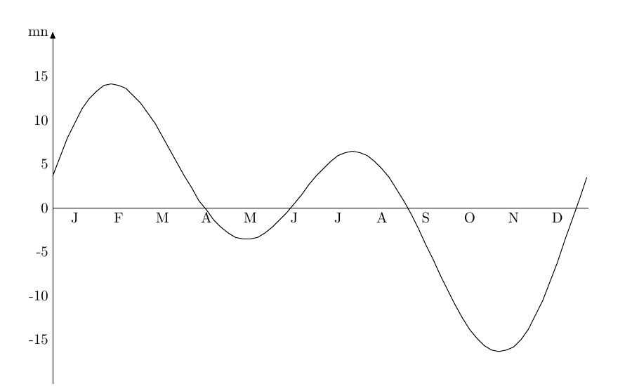
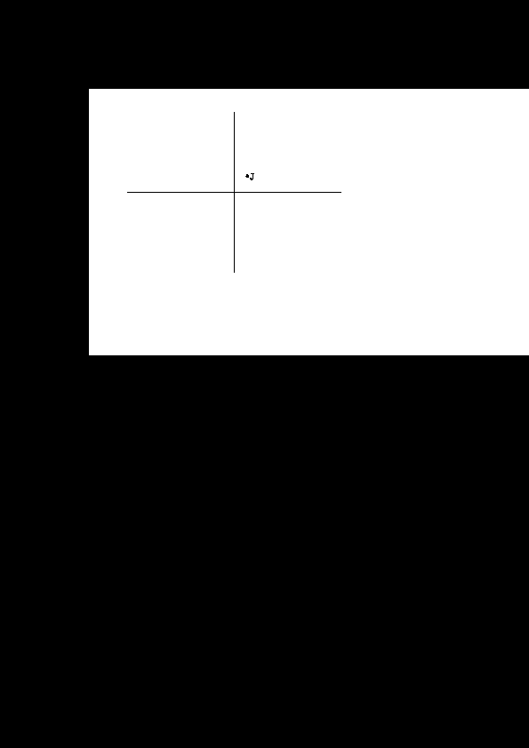
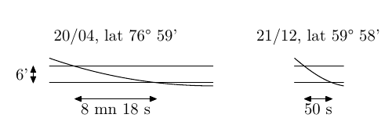

# Statut du document

Ce texte est diffusé sous la licence _Creative Commons_
CC-BY-ND : avec attribution et me demander avant de modifier
le contenu.

Copyright (c) 2017--2021 Jean Forget, tous droits réservés.

Je tiens à signaler que je ne suis pas un astronome professionnel.
Il est possible que le texte ci-dessous contienne des erreurs.
Soyez-en conscients. Je décline toute responsabilité pour les conséquences
qui résulteraient de votre lecture du texte. La clause de non-responsabilité
présente dans la GPL et dans la licence _Artistic_ s'appliquent non seulement
au code Perl, mais aussi aux textes français (et anglais).

Le texte est fréquemment (mais irrégulièrement) mis à jour
sur Github. Il y a une version française et une version
anglaise. Comme je suis plus à l'aise pour discuter d'astronomie
en français, la version anglaise risque d'être légèrement à la
traîne par rapport à la version française.

Ce texte fait partie intégrante de la distribution du module.
Il est donc visible sur les sites web de CPAN
([https://metacpan.org](https://metacpan.org), par exemple).
Mais il ne donne lieu à aucune installation.
Du coup, je pense qu'il est absent des paquets `.deb`
et `.rpm` qui pourraient être construits pour ce module.

Bien  que  ce  texte  fasse   partie  de  la  distribution  du  module
[Astro::Sunrise](https://metacpan.org/pod/Astro::Sunrise),     il     documente    également     le     module
[DateTime::Event::Sunrise](https://metacpan.org/pod/DateTime::Event::Sunrise), dont le noyau (calculs astronomiques) est
très semblable  et dont l'API  est différente. Comme les  deux modules
évoluent à des vitesses différentes,  le présent texte peut se révéler
en déphasage avec le module [Astro::Sunrise](https://metacpan.org/pod/Astro::Sunrise).

# Pourquoi ce texte, et pour qui

Le but principal de ce texte est de donner des
explications sur le calcul des levers et des couchers
du Soleil, explications trop longues et trop techniques pour avoir leur place
dans la documentation POD du module.

## Pour qui ? pour mon nounours

Avez-vous lu 
[Le guide de brian pour résoudre tout problème Perl](http://articles.mongueurs.net/traductions/guide_brian.html) ?
Même si l'écrasante majorité des conseils concerne le débugage
d'un programme Perl erroné, quelques conseils s'appliquent à
n'importe quel problème intellectuel.
L'un de ces conseils généralistes consiste à 
[parler à votre nounours](http://articles.mongueurs.net/traductions/guide_brian.html#item_En_avez_vous_parl__au_nounours_nbsp__).
Ne vous contentez pas de faire semblant et d'imaginer que vous
parlez à votre nounours, il faut réellement parler à haute voix
avec des phrases cohérentes et bien formées.  Cela dit, dans mon
cas, le sujet est trop vaste pour être abordé en une discussion d'un
quart d'heure avec mon nounours. J'ai préféré passer au stade supérieur et je préfère
_écrire_ à mon nounours via GitHub.

Ainsi donc, j'écris ce texte pour raconter à mon nounours
les problèmes que j'ai rencontrés lors de la maintenance
du module et les choix que j'ai faits alors.
Mais surtout, c'est pour lui expliquer le fonctionnement de l'algorithme itératif, 
[décrit succintement](https://www.stjarnhimlen.se/comp/riset.html#3) 
par Paul Schlyter
dans son site web et qu'il n'a pas mis à disposition du public
sous une forme compilable et exécutable (contrairement à la
[version simple sans itération](https://www.stjarnhimlen.se/comp/sunriset.c)).

## Pour qui ? pour le prochain mainteneur du module

Le deuxième destinataire de ce texte, c'est le futur mainteneur
du module. J'ai lu 
[le message de Neil Bowers](http://codeverge.com/perl.module-authors/the-module-authors-pledge/744969)
_The module authors pledge_. Je suis d'accord avec le principe
et je déclare ici que si pour une raison ou pour une autre je cesse
de m'occuper de mes modules, alors j'accepte que la maintenance
de mes modules soit confiée à une autre personne.

Ce que Neil n'a pas rappelé, c'est que le repreneur doit
réunir trois conditions, la compétence en programmation,
les ressources notamment en termes de temps disponible
et la volonté ou l'enthousiasme nécessaire pour s'atteler
à la tâche.

Toutefois, dans le cas des modules de calculs astronomiques,
il ne s'agit pas simplement de _la_ compétence (en programmation)
mais _des_ compétences, en programmation et en astronomie.
Il faut que ce futur mainteneur comprenne la problématique
de ces calculs. Lisez le texte et si vous comprenez pourquoi
tel ou tel point me tracasse, alors vous avez la compétence astronomique
nécessaire pour maintenir le module. Et si vous pensez que j'enfonce
des portes ouvertes, ou si vous pouvez
fournir instantanément une réponse argumentée à mes questions, c'est encore mieux.
Mais si vous n'arrivez pas à suivre mes explications et si, de
toutes manières, les sinus et les cosinus vous rebutent, ce n'est
pas la peine d'essayer de regarder le contenu du module.

## Pour qui ? pour ceux qui ont trouvé (ou croient avoir trouvé) un bug

Ce texte est également destiné aux utilisateurs qui pensent
avoir trouvé un bug dans le module ou qui veulent proposer une bonne idée.
Peut-être que le bug a déjà été constaté et qu'il est en attente
de solution.
Peut-être que le bug a déjà été constaté et que la solution adoptée
ne convient pas. Peut-être que l'amélioration suggérée a déjà été
rejetée parce qu'elle est en contradiction avec le coeur du module.

## Pour qui ? pour les utilisateurs intéressés

Finalement, ce texte est destiné à toute personne intéressée par
l'astronomie. J'ai essayé de ne pas faire appel à des calculs
trop compliqués. Leur place est dans le source Perl, pas ici.
Mais ne soyez pas étonnés si vous tombez sur des calculs simples
ou des raisonnements mathématiques basiques.

## Remarques sur le style

Certains passages de ce texte prennent la forme d'une série de
questions-réponses. Il ne s'agit pas d'une FAQ. C'est plutôt
une façon un peu plus pédagogique de présenter progressivement un
sujet. Ce procédé a été utilisé, entre autres, par Platon,
Galilée et Douglas Hofstadter.

## Autres remarques

J'examine généralement les phénomènes du point de vue d'une personne se trouvant
dans l'hémisphère nord, entre le tropique du Cancer et le cercle polaire
arctique. Par exemple, j'écrirai qu'au moment de midi, le Soleil se trouve
plein sud, alors que tous les écoliers australiens, néo-zélandais, sud-africains,
argentins et de quelques autres pays savent qu'à midi le Soleil est au nord.

De même, le 21 mars est habituellement appelé « équinoxe de printemps »
alors que c'est l'automne qui commence dans l'hémisphère sud à cette date.

Mais vouloir faire du politiquement correct conduit à des
tournures de phrase alambiquées, ce qui nuit à la compréhension
des phénomènes présentés.

À propos des minutes et des secondes : il y a un problème dans la mesure où
les minutes et les secondes sont à la fois des unités d'angle (longitudes et latitudes)
et des unités de temps (durée et repérage d'un instant). J'ai adopté trois
formats différents pour favoriser la distinction entre ces cas :
« 12:28:35 » pour le repérage d'un instant, « 2 h 28 mn 35 s » pour les
durées et « 59° 28' 35" » pour les angles (latitudes, longitudes et autres).
Donc, même s'il n'y a pas d'indication de degré ou d'heure, vous pourrez faire
la distinction entre un angle « 28' 35" » et une durée « 28 mn 35 s ».

# Sources

Je ne donnerai ici que les sources fournissant ou générant des jeux étendus
de valeurs numériques. Les livres et articles purement descriptifs
que j'ai pu lire ces décennies passées sont trop nombreux pour être
énumérés.

## Sources que je n'ai pas utilisées

Je commence par les sources que je n'ai pas utilisées, car elle ne me permettent
pas de maîtriser les données générées, à cause du manque de description de l'algorithme
ou de l'impossibilité de choisir les paramètres de génération.

- L'almanach du facteur

    Les almanachs du facteur fournissent les heures de lever et de coucher
    du Soleil pour une année entière. Mais ces heures sont données à la minute près,
    pas à la seconde près. Et même si c'est une édition provinciale, le lever
    et le coucher du Soleil est toujours donné pour Paris. Finalement, le mode de
    calcul exact n'est pas donné.

- L'Institut de Mécanique Céleste et de Calcul des Éphémérides IMCCE

    Ce [site](https://www.imcce.fr/langues/fr/index.html)
    fournissait un formulaire HTML pour obtenir le tableau des
    levers et couchers du Soleil pour le lieu de votre choix et pour la
    période de votre choix. Hélas, cette page a disparu de leur site.

    Il existe en revanche un 
    [générateur sous forme de service web](http://vo.imcce.fr/webservices/miriade/?rts),
    mais je ne l'ai pas essayé.

## Sources utilisées

- Le site web de Paul Schlyter

    Ce [site](https://www.stjarnhimlen.se/english.html)
    fournit un
    [programme C](https://stjarnhimlen.se/comp/sunriset.c) 
    prêt à l'emploi donnant les heures
    de [lever et de coucher](https://stjarnhimlen.se/comp/riset.html) 
    du Soleil.
    Comme le fait remarquer Paul Schlyter, c'est la version simple de l'algorithme,
    qui peut présenter des erreurs d'une ou deux minutes en général, ou plus si
    en fonction du lieu et de la date, on est proche du début ou de la fin de la
    période où le Soleil est visible à minuit.

    Le site web de Paul Schlyter propose
    de [nombreuses informations](https://stjarnhimlen.se/comp/ppcomp.html) 
    concernant le calcul des positions des corps célestes. Ce site est très
    intéressant, mais j'ai préféré reprendre à ma sauce (et en français) la
    description du calcul de la position du Soleil, en laissant tomber les autres
    corps célestes.

- L'observatoire de l'US Navy

    [L'observatoire de l'US Navy](http://aa.usno.navy.mil/faq/index.php) 
    propose un
    [formulaire](http://aa.usno.navy.mil/data/docs/RS_OneYear.php)
    pour calculer l'heure du lever et l'heure du coucher du Soleil.
    L'heure est donnée à la minute près, alors que j'aurais préféré
    une précision à la seconde près, tant pis.

    Notons toutefois que ce site fournit des 
    [informations très intéressantes](http://aa.usno.navy.mil/faq/index.php)
    (en anglais) sur le calcul de la position des corps célestes, mais sans se focaliser sur
    la position du Soleil comme je le fais ici.

- Le calculateur solaire de la NOAA

    [Les laboratoires de recherche sur la Terre de la NOAA](https://www.esrl.noaa.gov/)
    proposent un
    [calculateur solaire](https://www.esrl.noaa.gov/gmd/grad/solcalc/)
    similaire à celui de l'observatoire de l'US Navy.

- Stellarium

    Stellarium est un planétarium pour PC. Si l'on ne se préoccupe pas de la visualisation en temps
    réel du ciel, le logiciel permet de choisir un lieu d'observation, une date à la seconde près
    et un objet céleste. Il donne alors les coordonnées de cet objet céleste dans divers systèmes
    de coordonnées : azimuthales, équatoriales et écliptiques. Voici comment procéder pour
    obtenir le lever du Soleil, son coucher ou le midi vrai (version 0.18.0).

    - Déterminer une valeur approximative de l'heure recherchée : 12:00 pour le midi vrai,
    ou bien utiliser [Astro::Sunrise](https://metacpan.org/pod/Astro::Sunrise) en mode simple pour le lever ou le coucher.
    - Déterminer le critère de recherche : azimuth à 180 degrés pour le midi vrai, ou
    bien hauteur réelle à 0 degré et _xx_ minutes sous l'horizon. _xx_ est choisi pour
    être compatible avec le paramètre `alt` (hauteur) des fonctions de [Astro::Sunrise](https://metacpan.org/pod/Astro::Sunrise).

        Note : on ne tient pas compte de la hauteur apparente fournie par Stellarium.
        Pour la déviation des rayons lumineux au voisinage de l'horizon, on adopte le
        point de vue de [Astro::Sunrise](https://metacpan.org/pod/Astro::Sunrise), utiliser une valeur conventionnelle de 35'
        ou 0,583 degré et on tente d'obtenir cette valeur dans Stellarium.
        Et si on veut en plus tenir compte du rayon du disque solaire, on prendra la
        valeur moyenne 15' au lieu de la recalculer en fonction de la distance Terre-Soleil.
        Il faudra alors viser la hauteur de 50' sous l'horizon, soit 0,833 degré.

    - Dans Stellarium, figer le temps par `7` si ce n'est pas encore fait.
    - Rechercher le Soleil, la fenêtre de recherche s'activant par `<F3>`.
    - Vous pouvez préférer l'affichage sans le sol ni l'atmosphère. Il faut utiliser les 
    bascules `g` et `a`. Et `e` ou `z` pour avoir la grille des coordonnées
    équatoriales ou azimuthales, selon vos préférences du moment.

        Vous remarquerez que lorsque l'atmosphère est désactivée, on ne voit plus
        l'affichage des coordonnées apparentes du Soleil. Cela justifie le choix de
        se baser sur les coordonnées réelles.

    - Presser `<F6>` pour spécifier le lieu d'observation. Prendre un
    lieu situé sur le méridien de Greenwich, ainsi le temps UTC coïncidera
    avec le temps solaire moyen. Il faut bien penser à cocher la case
    « utiliser un fuseau horaire personnalisé » et choisir le fuseau
    UTC.

        Dans la version 0.18.0, il est possible d'utiliser « Royal
        Observatory (Greenwich) ». Dans la version précédente, j'ai dû
        créer un lieu d'observation à 51° 28' 40" de latitude nord,
        5" de longitude est et 27 m de hauteur. La longitude et la latitude
        correspondent aux coordonnées de l'observatoire de Greenwich données
        sur Wikipedia, la hauteur est le reliquat du lieu précédemment
        utilisé. Elle ne correspond pas à l'altitude de l'observatoire, ou
        alors c'est une heureuse coïncidence.

    - Presser `<F5>` pour spécifier la date et l'heure.
    - Sans fermer la fenêtre date-heure, essayer plusieurs valeurs jusqu'à trouver celle
    qui produit la meilleure approximation de l'azimuth ou de la hauteur recherché.

    Dans la version que j'utilisais avant la version actuelle 0.18.0, le
    choix de l'heure UTC n'était pas une propriété du lieu d'observation,
    mais un paramètre global de l'application. Il fallait taper `<F2>`
    pour avoir le menu de configuration. Dans ce menu, il fallait
    choisir l'onglet `Plugins`, puis `Fuseau horaire`. Il était alors
    possible de demander l'affichage de l'heure UTC au lieu du fuseau
    horaire de celui du PC. Ne pas oublier de sauvegarder la configuration
    en sortant.

# Héliocentrisme ou géocentrisme ?

Voici deux propositions. Sont-elles vraies ou fausses ?

- A

    Le Soleil tourne autour de la Terre.

- B

    La Terre tourne autour du Soleil.

La phrase A est fausse, tout le monde en convient, mais la phrase B
est fausse également.

Ah oui, me direz-vous, en fait c'est :

- C

    La Terre décrit une orbite elliptique avec le Soleil situé sur l'un des
    foyers de cette ellipse.

Cette affirmation est fausse également.
Chacune des affirmations suivantes est plus proche de la réalité que
les phrases B et C (et A).

- D

    Le centre d'inertie du système binaire Terre-Lune décrit une orbite
    elliptique avec le centre d'inertie du système solaire, situé sur l'un
    des foyers de cette ellipse.

    En faisant remarquer que le centre de gravité du Soleil et celui du système
    solaire sont deux points différents. Il y a même des périodes où le
    centre d'inertie du système solaire se trouve _à l'extérieur_ du Soleil.
    La [page web](http://hp41programs.yolasite.com/solar-sys-bary.php)
    d'un programme pour HP-41 indique que le 15 mars 1983, la distance entre
    le centre de gravité du Soleil et le centre de gravité du système solaire
    était quasiment 2,1 rayons solaires.

- E

    La Terre orbite autour du Soleil avec des perturbations notables dues
    à la Lune, à Jupiter, à Saturne, etc.

    Ce qui est une formulation différente du point précédent.

- F

    Le mouvement de la Terre au sein du système solaire est un problème
    à _n_ corps, avec _n_ ≥ 3. Donc il n'admet pas de solution analytique.

- G

    Le système solaire est un système chaotique. Même si l'on peut prédire avec
    un degré raisonnable de certitude à quoi ressembleront les orbites dans
    une centaine de millions d'années, ce genre de prédiction est illusoire pour
    un intervalle d'un milliard d'années.

- H

    La Terre se déplace en colimaçon dans la direction générale de la constellation Hercule
    à la vitesse approximative de 220 km/s.

- I

    La Terre orbite autour du centre de la Voie Lactée avec des perturbations notables dues
    au Soleil, à la Lune, à Jupiter, à Saturne, etc.

La proposition B ou C est ce que Terry Pratchett, Jack Cohen et Ian Stewart appellent des « mensonges
pour les enfants » (_la Science du Disque-Monde_, chapitre 4, pages 38 et 39 dans
la version originale). Ce sont des énoncés faux, mais suffisamment simples pour être compris par des
enfants et qui, malgré leur inexactitude, font progresser lesdits enfants vers la
vérité. Il est illusoire de faire comprendre à un enfant l'énoncé C
s'il n'a pas déjà appris, compris et admis l'énoncé B. Et c'est la même chose, en pire,
avec les énoncés D et suivants.

Qui plus est, ce sont ce que j'appelerai des « mensonges pour les adultes ». Au début, on considérait
que la physique était une représentation mathématique du monde réel, se rapprochant de plus
en plus de la vérité ultime. Puis il y a eu la physique quantique, avec
notamment le principe de dualité onde / corpuscule de de Broglie et son
interprétation par l'école de Copenhague. La nature ultime de l'électron (par exemple)
est-elle corpusculaire ? Est-elle ondulatoire ? La réponse est « Ni l'une
ni l'autre et de toutes façons, on s'en fiche. » La vocation de la physique n'est
plus de fournir _une représentation_ mathématique de la réalité ultime,
mais de fournir _des modélisations_  mathématiques de la réalité ultime.
On sait que les modèles proposés sont faux, mais ils permettent de faire
des calculs.

Remarquez que je parle ici de méthode scientifique. Mon propos n'était
pas de caractériser la publicité ou les campagnes électorales.
Cela ne fait de doute pour personne ou presque que ce sont des tissus
de mensonges.

Autres mensonges pour les adultes, également appelés « hypothèses
simplificatrices », utilisés dans ce texte :

- la lumière se propage instantanément d'un point à l'autre de l'espace,
- les astres extérieurs au système solaire sont immobiles,
- ils sont situés sur une sphère appelée « sphère céleste »,
- le temps UTC et le temps GMT sont identiques
- la Terre est parfaitement sphérique, sans le moindre aplatissement aux pôles ni le moindre renflement à l'équateur.
- la Terre est parfaitement sphérique, sans la moindre montagne, la moindre vallée et la moindre taupinière,
- il y a même un endroit où je laisse entendre que la durée d'une 
année astronomique est un nombre entier de jours (365, bien sûr),
- et, ainsi que je l'ai déjà signalé, tous les endroits
dignes d'intérêt sur la Terre se situent entre le tropique du Cancer et le cercle 
polaire arctique.

Remarquez que, de temps en temps, dans certains paragraphes, je laisserai tomber certains de ces
mensonges. Toutefois, le plus souvent, la plupart de ces mensonges sont en vigueur.

## Conclusion

Tout ça pour dire que dans la suite, j'utiliserai aussi bien le modèle
géocentrique où le Soleil tourne autour de la Terre en 24 heures
que le modèle géocentrique où le Soleil tourne autour de la Terre
en 365,25 jours ou le modèle héliocentrique.

« Il n'est pas nécessaire que ces hypothèses soient vraies, ou
même vraisemblables. Une chose suffit : qu'elles offrent des
calculs conformes à l'observation. »

Extrait de la préface d'Osiander au livre de Copernic, extrait repris
par Jean-Pierre Petit comme avant-propos à son livre 
[« Cosmic Story »](https://www.savoir-sans-frontieres.com/JPP/telechargeables/Francais/cosmic_story.htm).
À l'époque de Copernic, le but d'Osiander était de faire admettre l'héliocentrisme à des
lecteurs partisans inconditionnels du géocentrisme. Ironiquement, je reprends
cette citation pour faire admettre le géocentrisme à des lecteurs partisans
inconditionnels de l'héliocentrisme.

# Les mouvements du Soleil ou de la Terre

## Les mouvements de base

Dans  un repère  héliocentrique axé  sur les  étoiles fixes,  la Terre
tourne autour du Soleil en un an.  Ou, ce qui revient au même, dans un
repère géocentrique, le Soleil tourne autour de la Terre en un an avec
une  vitesse angulaire  moyenne de  0,9856 degré  par jour  ou 0,04107
degré par heure.

D'autre part, la  Terre tourne sur elle-même en 23h  56mn 4s, avec une
vitesse  de rotation  de  4,178e-3 degré  par  seconde, soit  360,9856
degrés par jour ou 15,04107 degrés par heure.

Q: Je croyais que la Terre tournait sur elle-même en 24h !

R: Pendant que la Terre tourne sur elle-même, le Soleil tourne
autour de la Terre. Et ce que nous voyons, c'est la composition
de ces deux mouvements, qui donne une vitesse angulaire moyenne
de 360 degrés par jour. Ce qui intéresse le commun des mortels,
c'est de retrouver le Soleil à place fixe de jour en jour.
Et seulement ensuite, le commun des mortels prend du recul, étudie
son environnement, découvre l'astronomie et s'intéresse à la position de la
Lune, des étoiles et des planètes.

Q: Et pourquoi as-tu prononcé à deux ou trois reprises
l'expression « vitesse angulaire moyenne » ?

R: Parce que la vitesse angulaire du Soleil n'est pas
constante. Nous y reviendrons ultérieurement.

## Les systèmes de coordonnées

L'écliptique est le plan qui contient l'orbite de la Terre autour du Soleil
(avec un modèle héliocentrique) ou l'orbite du Soleil autour de la Terre
(avec un modèle géocentrique). On définit également le plan équatorial,
le plan qui contient le cercle de l'équateur terrestre. Ces deux plans ont
un angle de 23° 26' et leur intersection s'appelle la ligne des noeuds.
Dans certains cas il est plus intéressant de considérer que la
ligne des noeuds est une demi-droite plutôt qu'une droite complète.
On considère alors que la ligne des noeuds est la demi-droite avec
le centre de la Terre pour origine et se dirigeant vers la constellation
des poissons. Et le point où cette demi-droite rencontre
la sphère céleste s'appelle _point gamma_ (politiquement correct) ou
_point vernal_ (politiquement incorrect puisque cela correspond au début
de l'automne dans l'hémisphère sud).

Pour définir les coordonnées d'un point terrestre, on a l'habitude de partir d'un point
origine dans le Golfe de Guinée, là où l'équateur croise le méridien
de Greenwich. Puis on parcourt un premier arc de cercle le long
de l'équateur et un second le long d'un méridien (donc, à son origine, perpendiculaire à l'équateur).
Les deux angles obtenus sont appelés « longitude » et
« latitude ». Pour un astre, lorsque l'on utilise les
_coordonnées équatoriales_, c'est le même principe,
sauf que l'origine du premier arc se trouve sur la ligne des noeuds
et que les angles s'appellent 
« ascension droite » et « déclinaison ».
À cause d'une tradition, d'une charte ancienne ou de quelque chose comme ça,
l'ascension droite est exprimée en heures, minutes et secondes
et non pas en degrés. Cela dit, Paul Schlyter utilise des degrés décimaux pour
l'ascension droite. J'essaierai de donner les valeurs dans les deux
systèmes d'unités chaque fois que j'en aurai besoin.

Les _coordonnées écliptiques_ suivent le même principe,
en traçant le premier arc le long de l'écliptique au lieu
de l'équateur. Et de même, le second arc de cercle est, au point de départ,
perpendiculaire à l'écliptique. Les deux angles s'appellent
« longitude écliptique » et « latitude écliptique »
respectivement. La position origine de la longitude écliptique est la ligne des
noeuds comme pour l'ascension droite, ce qui permet une simplification appréciable des formules
de conversion d'un système à l'autre. D'un autre côté, l'utilisation 
d'heures minutes et secondes pour l'ascension droite et de degrés pour
tous les autres angles introduit une complication superflue à la conversion.

Notons qu'en raison de la définition de l'écliptique, la latitude écliptique
du Soleil est toujours égale à zéro.

Finalement, il y a le système de coordonnées locales. Pour un astre dans le
ciel, on cherche la projection sur le sol ou plus exactement sur le plan tangent
au sol. L'angle entre le nord et cette projection est appelé « azimut »
(ou « azimuth »)
et l'angle entre la projection et l'astre lui-même est appelé « hauteur ».

### Le temps sidéral

Le temps sidéral est une notion ambivalente. Il existe deux écoles
de pensée pour définir cette notion. Curieusement, alors que les deux classes de
définition sont très divergentes, je n'ai pas rencontré de controverse
entre les partisans de ces deux écoles de pensée, chacun semblant ignorer "ceux d'en face".

La première école de pensée considère que le temps sidéral, malgré le terme utilisé,
désigne un angle. Voir
[https://fr.wikipedia.org/wiki/Temps\_sid%C3%A9ral](https://fr.wikipedia.org/wiki/Temps_sid%C3%A9ral)
[https://www.futura-sciences.com/sciences/definitions/univers-temps-sideral-960/](https://www.futura-sciences.com/sciences/definitions/univers-temps-sideral-960/)
[http://users.skynet.be/zmn/docs/temps/TempsSideral2.html](http://users.skynet.be/zmn/docs/temps/TempsSideral2.html)
[https://astrochinon.fr/index.php/documents/nos-dossiers/95-le-temps-sideral-de-greenwich](https://astrochinon.fr/index.php/documents/nos-dossiers/95-le-temps-sideral-de-greenwich).
Certes, cette notion est exprimée en heures, minutes et secondes, mais c'est déjà le
cas pour l'ascension droite dont tout le monde s'accorde à dire que c'est un angle.
Paul Schlyter appartient à cette école de pensée. Il déclare carrément que le
temps sidéral est l'ascension droite du méridien local. Il va même jusqu'à
calculer le temps sidéral en degrés décimaux, comme il le fait pour l'ascension droite. 

La deuxième école de pensée considère que le temps sidéral est bel et bien une
mesure du temps. Voir
[https://sites.google.com/site/astronomievouteceleste/5---temps-sideral](https://sites.google.com/site/astronomievouteceleste/5---temps-sideral)
[http://www.astrosurf.com/toussaint/dossiers/heuredetoiles/heuredetoiles.htm](http://www.astrosurf.com/toussaint/dossiers/heuredetoiles/heuredetoiles.htm)
[http://dictionnaire.sensagent.leparisien.fr/Temps%20sid%C3%A9ral/fr-fr/](http://dictionnaire.sensagent.leparisien.fr/Temps%20sid%C3%A9ral/fr-fr/)
et en anglais
[https://www.localsiderealtime.com/whatissiderealtime.html](https://www.localsiderealtime.com/whatissiderealtime.html)
et [https://en.wikipedia.org/wiki/Sidereal\_time](https://en.wikipedia.org/wiki/Sidereal_time).
Mais jamais ces descriptions n'abordent les questions qui
reviennent toujours à propos du temps : quelle est l'influence
des fuseaux horaires et de l'heure d'été sur le temps sidéral ?
Et les secondes intercalaires ?

En revenant à la définition "temps sidéral = angle", on constate
que si l'on prend deux points à la surface de la Terre, éloignés l'un
de l'autre dans la direction est -> ouest  de quelques kilomètres, ces deux
points ont des temps sidéraux légèrement différents
Donc, en revenant à la définition "temps sidéral = temps", on en déduit
que la notion de temps sidéral est incompatible avec le principe des
fuseaux horaires. Ai-je raison ou tort ? Je n'ai rien lu dans les descriptions
du "temps sidéral = temps" à ce sujet.

Entre une définition simple et exhaustive d'un côté et une définition floue et incomplète
de l'autre côté, j'opte pour la simplicité et je considère que le
temps sidéral est un angle.

## Les autres mouvements

Avant d'évoquer les autres mouvements faisant intervenir la
Terre et le Soleil, permettez-moi une petite digression.

### Météo et climat

J'ai horreur de ces gens qui, chaque fois qu'il neige, s'exclament
« Et dire qu'on nous parle de réchauffement 
climatique ! » Le climat et la météo sont deux choses différentes.
Quand la température relevée sous abri à 5 heures du matin
varie de 10 degrés du jour au lendemain, c'est un événement
météorologique ordinaire. Lorsque la température _moyenne_ sur dix ans
varie de deux degrés d'un siècle à l'autre, c'est une catastrophe climatique.

Les autres mouvements entre la Terre et le Soleil sont des mouvements
plus « climatiques » que « météorologiques ». Leurs valeurs à court
terme sont très faibles, ce qui fait que les algorithmes de calcul
des positions orbitales à court terme n'en tiennent pas compte.

Remarque : la météo (mais pas le climat) reviendra dans
quelques chapitres, mais ce ne sera plus une analogie.

### Précession des équinoxes

Le plus connu des mouvements à longue échéance est la précession des équinoxes.
En ce moment, le point gamma se trouve dans la constellation des poissons,
mais en réalité, il se déplace le long de l'écliptique en 26 000 ans
environ.

### Mouvement de nutation

L'angle entre le plan équatorial et le plan de l'écliptique varie très
légèrement. Dans le programme C de Paul Schlyter, l'angle diminue de 
356 nanodegrés par jour (3,56e-7 °/j, 1,3e-4 °/année).

### Avance du périhélie

Il y a également l'avance du périhélie. On connaît l'avance du
périhélie de Mercure parce que c'est le mouvement le plus prononcé, mais toutes
les planètes du système solaire subissent une avance de leur périhélie, y compris la Terre.

### Autres dérives et fluctuations

Les formules donnant les positions des astres reposent sur des constantes.
Mais ces valeurs sont constantes sur un intervalle de temps bref (à l'échelle
astronomique, ou pour reprendre la métaphore ci-dessus, sur un intervalle de
temps « plutôt météorologique »). Mais elles varient sur un intervalle de
temps nettement plus long (ou un intervalle « plutôt climatique »).
Par exemple, il est acquis que le jour dure 24 h (le jour solaire moyen, pas le jour
sidéral). J'ai lu quelque part qu'aux temps paléontologiques, le jour durait
22 heures environ.

La variation est lente, mais avec nos moyens modernes, il est possible de la mesurer.
Depuis que les scientifiques ont adopté un étalon atomique pour le temps, abandonnant
l'étalon astronomique, il a été nécessaire d'ajouter 
27 [secondes intercalaires](http://michel.lalos.free.fr/cadrans_solaires/doc_cadrans/seconde_intercalaire/seconde_intercalaire.html)
en 47 ans pour resynchroniser l'échelle de temps atomique avec
l'échelle de temps astronomique.

Pour l'instant, les interventions pour cette resynchronisation ont toujours consisté
à ajouter une seconde intercalaire. Mais la possibilité théorique existe de synchroniser
dans l'autre sens, en supprimant une seconde. Le phénomène peut donc, semble-t-il, se manifester
par des fluctuations au lieu d'une dérive toujours dans le même sens.

### Équation du temps

Il existe d'autres fluctuations, qui sont plus faciles à mesurer et qui se déroulent
sur une échelle plus « météorologique » et moins « climatique ».
Le midi solaire _vrai_ ne correspond pas avec le midi solaire _moyen_.
Il y a deux raisons pour cela.

#### Obliquité de la Terre

Tout d'abord, comme il existe un écart angulaire entre le plan de l'équateur
et le plan de l'écliptique, une rotation uniforme sur le plan de l'écliptique
se traduira sur le plan de l'équateur par une rotation à vitesse variable.

Si nous exprimons l'ascension droite et la longitude écliptique dans les mêmes
unités (degrés ou heures), alors leurs valeurs sont voisines, mais pas
égales. Ainsi, lorsque la longitude écliptique est de 46°20'31", l'ascension
droite est de 43°52'36", soit un écart de 2°27'54". Le même écart existe pour
la longitude écliptique de 226°20'31". Et pour une longitude
écliptique de 313°32'52", l'ascension droite est de 316°47", soit le même écart
en sens inverse, écart que l'on retrouve également pour la longitude écliptique
de 133°32'52". Ce sont les valeurs extrêmes des écarts pour l'obliquité
de 23° 26'. Et si vous préférez les heures, minutes, secondes, voici 
un tableau donnant les valeurs dans les deux systèmes :

    .   longitude  ascension droite    écart      longitude  ascension droite   écart
    .   3h05mn22s      2h55mn30s     -9mn51s      46°20'31"     43°52'36"     -2°27'54"
    .   8h54mn11s      9h04mn03s      9mn51s     133°32'52"    136°00'47"      2°27'54"
    .  15h05mn22s     14h55mn30s     -9mn51s     226°20'31"    223°52'36"     -2°27'54"
    .  20h54mn11s     21h04mn03s      9mn51s     313°32'52"    316°00'47"      2°27'54"

#### Deuxième Loi de Kepler

Ensuite, la rotation du Soleil sur le plan de l'écliptique n'est pas constante.
Elle suit la deuxième loi de Kepler, avec une vitesse angulaire inversement proportionnelle
à la distance Terre-Soleil.

Q : Tu ne peux pas appliquer valablement la deuxième loi de Kepler à un modèle géocentrique !

R : Non. La deuxième loi de Kepler s'applique à un modèle barycentrique comme D ci-dessus, 
ou à la rigueur un modèle héliocentrique comme C. Mais une fois que l'on a pu déterminer 
la vitesse angulaire de la Terre dans le modèle C, il est très simple de faire le changement
de coordonnées vers un modèle géocentrique. La valeur obtenue pour la vitesse angulaire du
Soleil autour de la Terre dans un modèle géocentrique est égale à celle de la vitesse angulaire
de la Terre autour du Soleil dans un modèle héliocentrique.

Voici les positions du Soleil données par Stellarium en 2017 en coordonnées équatoriales
puis converties en coordonnées écliptiques.

    date       ascension droite        déclinaison  longitude écliptique
    4 janvier  18h59mn1s 284°45'15"    -22°44'43"   -76°24'58" ou -76,4162°
    5 janvier  19h3mn24s 285°51'       -22°38'18"   -75°23'58" ou -75,3996°
    3 juillet   6h48mn   102°           22°58'35"   101°2'7"   ou 101,0355°
    4 juillet   6h52mn8s 103°02'        22°53'39"   101°59'26" ou 101,9907°

Soit une vitesse angulaire de 1,0166 degré par jour en longitude écliptique au périgée (dans un
modèle géocentrique, c'est-à-dire périhélie dans un modèle héliocentrique) et de 0,9552 degré
par jour à l'apogée (ou aphélie). Autre expression pour ces vitesses : 0,0423°/h et 0,0398°/h.

#### Équation du temps

La vitesse de rotation de la Terre sur elle-même est constante, 360,9856 degrés par jour
mais la vitesse de rotation du Soleil autour de la Terre ne l'est pas. La combinaison des
deux vitesses est donc variable et elle _n'est pas_ 360 degrés par jour. Le passage du
Soleil au méridien ne se produit donc pas exactement toutes les 86 400 secondes.
Il y a donc une différence entre le temps solaire _moyen_, dans lequel midi se produit exactement
toutes les 86 400 secondes et le temps solaire _vrai_ dans lequel midi, le moment où
le Soleil passe au méridien, fluctue légèrement. La différence entre le temps solaire
moyen et le temps solaire vrai s'appelle l'_équation du temps_.

Voici quelques valeurs extrêmes pour l'équation du temps en 2017, obtenues par un script
basé sur [DateTime::Event::Sunrise](https://metacpan.org/pod/DateTime::Event::Sunrise) et contrôlé avec Stellarium.

    Date          DT::E::S    Stellarium
    2017-11-02    11:43:33    11:43:37   -16mn23s  la valeur la plus tôt
    2017-02-10    12:14:12    12:14:14   +14mn14s  la valeur la plus tardive
    2017-09-11    11:56:33    11:56:34    -3mn26s 
    2017-09-12    11:56:11    11:56:13    -3mn47s  la plus forte décroissance : 21 ou 22 secondes
    2017-12-17    11:56:11    11:56:14    -3mn46s 
    2017-12-18    11:56:41    11:56:44    -3mn16s  la plus forte croissance : 30 secondes

Et voici la courbe correspondante de l'équation du temps.

    

    
    

#### Analemme

L'irrégularité de la course du Soleil se matérialise également en se basant sur
le temps solaire moyen et en notant la position du Soleil dans le ciel lorsqu'il
est midi au temps solaire moyen. Les positions obtenues forment une courbe
en 8 appelé _analemme_ avec l'ascension droite en abscisse et la hauteur en ordonnée.

#### Soleil moyen, soleil virtuel homocinétique

Dans la suite de la discussion, il est utile d'imaginer un soleil dont la vitesse
angulaire serait constante (soit en coordonnées équatoriales, soit en coordonnées
écliptiques, selon le cas).

On parle ainsi du « Soleil moyen », qui est censé passer au méridien à 12:00
pile lorsque l'on utilise le « temps solaire moyen » et qui minimise l'écart
tout au long de l'année entre le midi solaire moyen et le midi solaire vrai.

Je prendrai en considération également des soleils virtuels homocinétiques, ou SVH. Ces
soleils virtuels sont synchronisés avec le Soleil réel à un instant donné et
ensuite bougent avec une vitesse angulaire constante.

# Calcul du lever et du coucher du Soleil

Le calcul du lever et du coucher du Soleil consiste à tenir compte à
la fois de la variation de la longueur de la journée et de
l'équation du temps pour savoir quand le Soleil atteint 
la hauteur qui correspond au lever ou au coucher du Soleil.

Dans le schéma ci-dessous, la variation de la longueur de la
journée se traduit par un déplacement haut-bas de la sinusoïde
(et, dans une moindre mesure une contraction-extension
haut-bas de la courbe). L'équation du temps se traduit
par un déplacement horizontal de la sinusoïde.

    

    
    

Q : Ouaaaaah ! Impressionnant, ton schéma !

R : Ne sois pas si impressionné. Il y a quelques écarts avec la réalité.
Tout d'abord, j'ai représenté la course  du Soleil par une sinusoïde parce
que c'était facile à programmer, mais je n'ai pas vérifié si ça collait à la
vérité et je parierais que la correspondance est approximative. Ensuite, l'équation du temps
est très largement exagérée. Au lieu d'un midi solaire vrai qui varie entre
11:43 et 12:15 du temps moyen, ici la variation est 4 fois plus importante,
faisant varier le midi solaire entre 11:00 (et même moins) et 13:00. Mais on n'aurait rien vu
sans cet élargissement.

Q : Et cette courbe en forme de huit, c'est l'analemme ?

R : Non. L'analemme montre la position en azimuth et hauteur du Soleil au moment du midi
solaire de temps _moyen_. La courbe ci-dessus donne en abscisse l'heure en temps moyen
du midi solaire vrai et en ordonnée la hauteur du Soleil à ce instant. 
En d'autres termes, l'analemme se base sur un événement temporel régulier, le midi
solaire moyen, et montre la corrélation de deux phénomènes spatiaux variables,
l'azimuth et la hauteur. À l'inverse, la courbe ci-dessus se base sur un
événement spatial précis, l'azimuth 180°, et montre la corrélation entre
un phénomène spatial variable, la hauteur du Soleil, et un phénomène temporel
variable, le midi solaire vrai.

Certes, les notions associées aux ordonnées sont voisines, comme une comparaison entre des carottes nantaises
et des carottes de Chantenay, mais comparer les abscisses entre les deux courbes,
c'est vouloir comparer des choux avec des carottes.

Q : Et la similitude de forme est une coïncidence ?

R : Non, ce n'est pas une coïncidence. Prenons pour commencer les
ordonnées. La courbe ci-dessus, que j'appelerai « pseudo-analemme », donne
la hauteur au midi solaire vrai, donc la hauteur maximale du Soleil pour
la journée. L'analemme donne la hauteur du Soleil au midi moyen, donc
forcément inférieure à la hauteur maximale (sauf à l'occasion des quatre jours
où l'analemme croise l'axe des Y). Mais comme on est au voisinage d'un point
à tangente horizontale, la variation est très faible.
Par exemple, le 2 novembre 2017, pour un observateur à l'observatoire de Greenwich,
le Soleil est à une hauteur de 23°37'39" au moment du midi solaire vrai (11h 43mn 37s)
et à une hauteur de 23°31'40" au moment du midi solaire moyen, un quart d'heure plus tard
(données obtenues dans Stellarium).

Pour les abscisses, c'est un peu plus compliqué. En reprenant l'exemple du 2 novembre
2017, au moment du midi solaire moyen, l'azimuth du Soleil est 184°19'08".
Donc, sur l'analemme, le point du 2 novembre est 4 degrés à droite de l'axe Y,
tandis que sur la pseudo-analemme ci-dessous, il est 16 mn 23s à gauche de l'axe Y.
Il y a donc non seulement un changement d'unités, mais aussi un changement de signe.
La pseudo-analemme et l'analemme sont donc, à peu près, symétriques l'une de l'autre.

Cf. [à la fin](#analemme-politiquement-correcte) pour une discussion politiquement
correcte de l'analemme et de la pseudo-analemme.

## Principe du calcul itératif

Il y a deux attitudes vis-à-vis de la variation du midi solaire vrai d'un jour à l'autre.
En prenant un observateur à Greenwich en septembre 2017, 
le midi solaire du 11 septembre se produit à 11:56:34 à une hauteur de 42°53'40"
et celui du lendemain se produit à 11:56:13 à une hauteur de 42°30'47".

On peut considérer que la valeur 11:56:34 est valide le 11 de zéro heure à minuit et
qu'elle saute instantanément à 11:56:13 le 12 septembre à zéro heure. Cela revient à dire
que la pseudo-analemme est un nuage de 365 points distincts.

Ou alors, on peut considérer que le midi solaire vrai évolue continûment d'un jour à l'autre
et que la pseudo-analemme est une courbe constituée d'une infinité de points.
Le calcul du coucher du Soleil en se basant sur le midi solaire vrai de 11:56:34 donne une 
heure 18:23:59. Puisque le midi solaire vrai a varié de 21 secondes en 86 379 secondes
(soit 1 jour moyen moins 21 secondes), par interpolation linéaire, à 18:23:59, soit 
23 225 secondes plus tard le midi solaire moyen aura varié de 5,6 secondes.
De même, la hauteur, qui varie de 22'53" en 86 379 secondes aura varié de 6'9"
en 23 225 secondes. On obtient un midi solaire vrai virtuel de 11:56:28 et
une hauteur de 42°47'31".

On déplace donc la courbe de la course du Soleil pour culminer sur ce point précis
et on recalcule l'intersection avec la ligne horizontale représentant le coucher
du Soleil. On obtiendra un point différent de 18:23:59, mais très proche de
18:23:59 et encore plus proche de la valeur donnée par Stellarium : 18:23:24.

## Mise en Oeuvre de l'Algorithme Simple

Faisons d'abord une digression avec l'algorithme simple. Nous prendrons l'exemple
du coucher du Soleil à Greenwich, le 4 janvier 2018. 

Le présent paragraphe et le suivant se basent sur le code Perl suivant :

    for(0, 1) { 
      say join( " | ",$_, sunrise({ year =>  2018, month =>  1, day => 4,
                                    lon  =>    0,  lat   => +51.5, tz  =>  0, isdst => 0,
                                    alt  => -.833, upper_limb => 0, precise => $_, polar => 'retval',
                                    trace => *STDOUT } ));
    }

L'algorithme simple commence par déterminer le midi solaire vrai du jour.
En reprenant l'exemple du paragraphe précédent, le 4 janvier
à Greenwich, le midi solaire vrai se produit à 12:04:56.

Puis on applique simultanément la rotation de la Terre sur elle-même (360,9856 degrés par jour)
et la rotation d'un SVH (rappel : soleil virtuel homocinétique) autour de la Terre (0,9856 degré par jour)
ce qui fait une vitesse combinée de 360 degrés par jour, soit 15 degrés
par heure. Et le coucher du Soleil se produit au moment où cette rotation combinée
amène le SVH à l'altitude cible.

Ainsi, pour le 4 janvier, l'écart entre le point de midi et le point du coucher
du Soleil est de 59,9746° (59° 58' 28"). Donc il faut 3,9983 heures (3 h 59 mn 53 s)
pour parcourir cet angle et le coucher du SVH se produit à 16:04:50.

## Mise en Oeuvre de l'Algorithme Précis

Avec l'algorithme précis, on dissocie la rotation de le Terre sur elle-même
(360,9856 degrés par jour) et la rotation du Soleil autour de la Terre.
De plus, on utilise implicitement la valeur réelle de la rotation du Soleil,
entre 0,9552 degré et 1,0166 degré par jour.

Première itération. On part du midi solaire vrai du jour à 12:04:56 et on applique
uniquement la rotation de la Terre sur elle-même (15,04107 degrés par heure).
La première valeur, très approximative, est le moment où la rotation
de la Terre amène le Soleil à l'altitude recherchée. 
Avec l'exemple du 4 janvier, cette première approximation
donne l'heure 16:04:11.

Pour la seconde itération, on détermine le midi solaire virtuel correspondant à la position du Soleil
à cette heure approximative 16:04:11. Ce midi solaire virtuel se produit à 12:05:01.
En partant de cette position, on applique la rotation de la Terre et on aboutit
à la seconde évaluation du coucher du Soleil, 16:04:23 (16.0731615074431 en notation décimale).

Pour la troisième itération, on détermine le midi solaire virtuel
correspondant à la position du Soleil à 16:04:23. Ce midi solaire virtuel se produit à 12:05:01. Là encore
nous appliquons la rotation de la Terre, pour aboutir à une troisième évaluation
du coucher du Soleil, 16:04:23, différant de la valeur de la seconde itération 
par une fraction de seconde : 16.0731642391519 au lieu de 16.0731615074431.
La différence étant 2,73e-6 heure, soit 9 ms, on quitte la boucle de calcul.

C'est une première façon de voir le calcul : le Soleil anticipe sa position
dans la soirée et reste immobile à cette position. Une autre façon de voir ce
calcul est :

Lors de la seconde itération, entre le midi solaire réel 12:04:56 et la valeur donnée
par la première itération 16:04:11, le Soleil tourne à la vitesse réelle de 1,0166 degré par jour
en même temps que la Terre tourne sur elle-même à la vitesse de 360,9856 degrés par jour.
Puis à 16:04:11, le Soleil s'immobilise et on ajuste en faisant tourner la Terre seulement.
Cela donne une nouvelle valeur 16:04:23 pour le coucher du Soleil.

Lors de la troisième itération, entre le midi solaire réel 12:04:56 et la valeur donnée
par la deuxième itération 16:04:23, le Soleil tourne à la vitesse réelle de 1,0166 degré par jour,
puis à 16:04:23, il se fige et ensuite on ajuste en faisant tourner la Terre seule sur elle-même. Le coucher du
Soleil se produit 9 millisecondes plus tard à 16:04:23. Il y a donc 3 h 59 mn 27 s où l'on utilise
la vitesse réelle du Soleil et 9 millisecondes où l'on utilise une vitesse franchement erronée.
On y gagne par rapport au calcul simple qui utilise une vitesse légèrement erronée pendant toute
la période de 3 h, 59 mn et 57 s.

## Que s'est-il passé au printemps 2020 ?

Remontons un  peu plus loin. En  janvier 2019, j'ai publié  la version
0.98 de  [Astro::Sunrise](https://metacpan.org/pod/Astro::Sunrise), avec l'implémentation du  calcul itératif.
Pour  les  données   de  test,  je  n'ai  pas  cherché   à  faire  des
vérifications croisées  avec d'autres sources, j'ai  juste vérifié que
le calcul  itératif aboutissait et  que le  résultat était à  peu près
correct.    Je    n'ai    pas    cherché    à    mettre    à    niveau
[DateTime::Event::Sunrise](https://metacpan.org/pod/DateTime::Event::Sunrise), j'estimais  que ce n'était pas  encore le
moment.

Puis, en avril 2020, un utilisateur  a créé un ticket expliquant qu'il
avait comparé  les résultats  de [DateTime::Event::Sunrise](https://metacpan.org/pod/DateTime::Event::Sunrise)  avec des
sites web de référence et que les résultats n'étaient pas très précis.
Certes, le module [DateTime::Event::Sunrise](https://metacpan.org/pod/DateTime::Event::Sunrise) n'était pas au niveau de
[Astro::Sunrise](https://metacpan.org/pod/Astro::Sunrise), donc  la remarque  était justifiée. Cela  m'a donné
deux choses : tout d'abord une source de référence pour le calcul jour
après jour du lever du Soleil, de son coucher et du midi solaire réel.
D'autre    part,   cela    m'a   donné    l'impulsion   pour    mettre
[DateTime::Event::Sunrise](https://metacpan.org/pod/DateTime::Event::Sunrise)  au même  niveau que  [Astro::Sunrise](https://metacpan.org/pod/Astro::Sunrise) et
pour utiliser des données de tests correctes, issues des sites web que
l'utilisateur avait pris pour références.

Seulement voilà,  l'algorithme précis  hérité de  [Astro::Sunrise](https://metacpan.org/pod/Astro::Sunrise) et
les données  de tests extraites du  site de la NOAA  ne collaient pas.
Après avoir  trituré l'algorithme  dans tous les  sens et  après avoir
demandé conseil sur la liste DateTime
([https://www.nntp.perl.org/group/perl.datetime/2020/06/msg8241.html](https://www.nntp.perl.org/group/perl.datetime/2020/06/msg8241.html)),
je me  suis rendu à  l'évidence que l'algorithme donnait  de meilleurs
résultats avec une  vitesse de 15 degrés par heure  qu'avec la vitesse
normale  de 15,04107  degrés par  heure.  J'ai donc  publié le  module
[DateTime::Event::Sunrise](https://metacpan.org/pod/DateTime::Event::Sunrise)  avec   la  valeur   15,  alors   que  mes
explications  donnaient  une  bonne  raison pour  utiliser  la  valeur
15,04107.

### Qu'est-ce qui cloche ?

Je pense que mes explications sur l'algorithme précis proposé par Paul
Schlyter  sont   correctes  et  que  c'est   l'implémentation  de  cet
algorithme qui  cloche. En reprenant  les valeurs données  ci-dessus à
titre d'exemple,  lors de  la deuxième  itération, nous  sommes censés
utiliser le Soleil tel qu'il est positionné à 16:04:11. Je pense qu'en
réalité, le programme  calcule le midi solaire  virtuel pour 16:04:11,
qui donne 12:05:01 et qu'ensuite il utilise le Soleil à sa position de
12:05:01.

Comment le vérifier ?  Pour cela, il faudrait que je  puisse « créer »
une étoile fixe au point occupé par  le Soleil à 16:04:11. Et ça, je n'ai
pas  trouvé  comment  faire.  Quelques  mois  plus  tard,  en  lisant  la
documentation de Stellarium version 0.20.1-1, chapitre 13, j'ai découvert
que l'on pouvait ajouter des  novas aux catalogues officiels. J'ai essayé
avec Stellarium 0.18.0 et je n'ai pas réussi. Impossible donc de vérifier
l'implémentation de l'algorithme itératif.

# Examen détaillé des paramètres

Ci-dessous, je détaille diverses informations à savoir sur les paramètres de calcul,
informations qui auraient été trop longues pour la documentation interne
du module et qui auraient noyé dans un flot d'informations un lecteur non
averti.

## Choix de l'algorithme, paramètre `precise`

Q : Quand est-il préférable de choisir l'algorithme précis ?

R : La réponse courte, c'est « jamais ». La réponse développée est la suivante.

- Si tu veux déterminer l'un des crépuscules, utilise l'algorithme de base.
- Si tu vis entre les deux cercles polaires, utilise l'algorithme de base.
- Si la date est éloignée d'une transition entre la période jour+nuit et
la période de nuit polaire ou la période du Soleil de minuit, utilise
l'algorihme de base.
- Si la date est voisine d'une transition entre la période jour+nuit et
la période de nuit polaire, utilise l'algorihme de base.
- Si tu habites dans une zone polaire ET que la date est voisine d'une
transition entre la période d'alternance jour/nuit et la période 
du Soleil de minuit ET si tu t'intéresses
à la visibilité du disque solaire au-dessus de l'horizon, alors tu
peux utiliser l'algorithme précis.

    À noter que quelqu'un situé légèrement au sud du cercle polaire arctique
    (par exemple, à Reykjavik) a intérêt à utiliser l'algorithme précis aux
    alentours du 21 juin. De même, l'algorithme précis est conseillé aux alentours
    du 21 décembre pour les endroits légèrement au nord du cercle polaire
    antarctique

Q : On peut savoir les raisons pour lesquelles l'algorithme précis sert si peu ?

R : Reprenons l'animation de la courbe de la course du Soleil qui se déplace
par rapport à la pseudo-analemme. Mais au lieu de nous situer à Greenwich,
nous nous placerons au-delà du cercle polaire. Nous ne quittons pas le méridien
de Greenwich, mais nous prenons place à 76 degrés et 59 minutes de l'équateur.

    

    
    

Comme tu peux le voir, aux alentours du 21 avril et du 21 août,
la course du Soleil est tangente ou quasiment tangente à la ligne d'horizon.
Dans ces conditions, une légère variation de 6' de la hauteur du Soleil
entraîne une variation nettement plus importante des points d'intersection
de la course du Soleil avec la ligne d'horizon.
Ainsi, le 20 avril 2017, au moment du coucher du Soleil,
il faut 8 mn 18 s pour que la hauteur diminue de 6'.

Q : D'où sors-tu cette valeur de 6' ?

R : C'est la valeur que j'ai calculée au chapitre
["Principe du calcul itératif"](#principe-du-calcul-itératif). C'est juste un exemple pour 
faire un calcul concret.

À l'inverse, si tu habites dans un lieu tempéré loin des cercles polaires,
la pente de la course du Soleil au point d'intersection est toujours
nettement oblique. Par exemple, à Greenwich, la pente la plus faible se produit
à chaque solstice et vaut de l'ordre de 6 à 7 degrés de hauteur par heure. Donc une variation de hauteur de 6' produira au
maximum une variation de l'heure de 50 secondes.

Le diagramme ci-dessous montre l'effet d'une translation verticale de 6' sur la course
du Soleil dans les deux cas : 20 avril à 76° 59' et 21 décembre à Greenwich.
Attention, le diagramme n'est pas à l'échelle.

    

    
    

Q : Et pour ceux qui habitent dans une région polaire, que se passe-t-il
aux dates éloignées des transitions ?

R : Si la période en cours est l'alternance jour/nuit, alors les mêmes
considérations que ci-dessus au sujet de la pente « nettement oblique » de la courbe s'appliquent.
Et dans le cas des deux autres périodes, nuit polaire et Soleil de minuit,
il n'y a pas d'intersection entre la course du Soleil et l'horizon et
aucune variation de hauteur, dans certaines limites, ne peut créer
un tel point d'intersection.

Q : Dans le cas de la transition avec la période de nuit polaire,
la course du Soleil est tangente à la ligne d'horizon, comme pour
la transition avec la période du Soleil de minuit. Alors pourquoi,
dans ce cas, conseilles-tu quand même l'algorithme de base ?

R : L'algorithme de base et l'algorithme précis essaient tous deux d'estimer
la longitude écliptique et la hauteur du Soleil au midi solaire virtuel correspondant
à l'heure du coucher du Soleil. Mais alors que l'algorithme précis utilise 
la vitesse réelle du Soleil, qui varie de 0,9552°/j à 1,0166°/j, l'algorithme
de base utilise une vitesse moyenne de 0,9856°/j, ce qui fait une erreur
de ±0,0310°/j. À l'occasion de la transition entre jour+nuit et le Soleil
de minuit, ce taux d'erreur prend effet pendant 11 heures, voire plus,
ce qui peut donner une erreur de 0,015° sur la longitude écliptique du Soleil.
En revanche, pour la transition entre jour+nuit et la nuit polaire, 
ce taux d'erreur court sur une heure ou moins, ce qui fait que l'erreur
sur la longitude écliptique ne peut pas dépasser 0,0013°.
Donc, même si à ce moment, une faible erreur sur la longitude écliptique
peut provoquer une grande différence sur l'heure du coucher du Soleil,
tu n'auras pas une _faible_ erreur, mais une erreur _infime_ sur la 
longitude écliptique.

Q : Et le cas des crépuscules ? On peut avoir le cas où la course du Soleil est
tangente à la ligne d'horizon, si je peux me permettre d'utiliser ce terme pour
une ligne située 24 degrés sous le plan horizontal. Et nous avons un écart de
≈12 heures comme dans le cas de la transition avec le Soleil de minuit, 
pas un écart d'une heure ou moins comme dans le cas de la transition
avec la nuit polaire.

R : Qu'est-ce qui t'intéresse lorsque tu calcules les heures de crépuscule ?
C'est d'avoir une luminosité la plus faible possible et les meilleures conditions
possibles pour l'observation des astres. Crois-tu qu'il y a une nette différence entre
une nuit où le point le plus bas du Soleil est 17°57' sous l'horizon et une nuit où ce même
point est à 18°3' ? Et il vaut mieux commencer à observer les astres lorsque
le Soleil est à, disons, -15° si tu sais que la Lune va se lever lorsque l'on
atteindra le crépuscule astronomique pour le Soleil ou si la météo annonce l'arrivée d'une
épaisse couche de nuages à ce moment.

## Hauteur, paramètre `alt` et paramètre `upper_limb`

Le paramètre `alt`, exprimé en degrés décimaux, permet de spécifier la hauteur
du soleil recherchée pour le lever ou le coucher du soleil ou le crépuscule.

Tout d'abord, les valeurs  recommandées pour les différents crépuscules sont
des valeurs purement conventionnelles. Il n'y a pas grand chose à dire à ce sujet.

Pour le lever et le coucher du soleil, la valeur habituelle est -0,833° (ou -50').
Elle se décompose en deux parties :

- -0,583° ou -35' pour la réfraction,
- -0,25° ou -15' pour le rayon du disque solaire

En fait, dans les deux cas il s'agit de valeurs approchées pour des grandeurs variables.
Le rayon du disque solaire varie entre 0,271° (ou 16'16") le 3 janvier,
lorsque la distance Terre-Soleil est minimale et 0,262° (ou 15'44") lorsque
la distance est maximale, le 3 juillet.

Quant à la déviation due à la réfraction, elle est fortement dépendante
du profil de température dans l'atmosphère, donc de la météo.

Vous pouvez affiner le calcul en fournissant un paramètre `alt` à -0,583 et en alimentant
le paramètre `upper_limb` à une valeur vraie (habituellement 1). Dans ce
cas, le rayon du disque solaire est recalculé pour chaque jour. En revanche,
pour la réfraction, vous devrez trouver la valeur réelle par un autre moyen que
le module Perl de calcul des levers et couchers du soleil.

Q: Donc, utiliser un paramètre `alt` à -0,583 et un paramètre `upper_limb` à 0 est stupide ?

A: Non, je dirais que c'est juste inhabituel.  Comme le signale Paul Schlyter
[dans son site web](http://www.stjarnhimlen.se/comp/riset.html#2), 
les almanachs nationaux de Suède définissent le lever et le coucher du soleil comme
l'instant où le _centre_ du disque solaire atteint l'horizon optique, alors que le consensus
international les définit comme étant l'instant où le _sommet_ du disque solaire atteint l'horizon
optique.

Q: En revanche, utiliser un paramètre `alt` à -0,833 et un paramètre `upper_limb` à 1 est stupide, n'est-ce pas ?

A: Je ne dirais pas que c'est stupide, ni inhabituel, je dirais plutôt que c'est douteux. En fait, la valeur
du paramètre se décompose en trois parties et non pas simplement deux :

- 0 pour la position du point d'observation par rapport au paysage environnant,
- -0,583° ou -35' pour la réfraction,
- -0,25° ou -15' pour le rayon du disque solaire, ou 0 si l'on alimente `upper_limb` à 1.

Mais si vous vous trouvez au sommet d'une tour de 60 mètres, la ligne d'horizon ne correspond plus
au plan horizontal, mais à un cône faisant un angle de 0,25° avec l'horizontale. Ainsi, nous avons :

- -0,25° (-15') pour la position du point d'observation par rapport au paysage environnant,
- -0,583° ou -35' pour la réfraction,
- pour le rayon du disque solaire, 0 si l'on alimente `upper_limb` à 1, ou bien -0,25° (-15') si `upper_limb` vaut 0.

C'est donc parfaitement valide, mais douteux parce que cela ne correspond pas à une situation habituelle.

Q: Compte tenu de ce que tu as dit pour le paramètre `precise`, est-ce que la différence entre 
`alt => -0.833, upper_limb => 0` et `alt => -0.583, upper_limb => 1` est sensible ?

R: Tu t'en doutes, quasiment pas. Prenons comme exemple le coucher du soleil à Fairbanks le 3 janvier 2020.
Je prends le 3 janvier, parce que c'est le jour où le diamètre apparent est le plus grand, soit 32'32" 
selon Stellarium, ce qui donne un rayon de 16'16". Et je prends Fairbanks, car au voisinage d'un cercle polaire,
la courbe du Soleil est moins pentue qu'au voisinage de l'équateur. Ainsi donc, pour 
`alt => -0.833, upper_limb => 0`, le coucher du soleil se produit lorsque
le centre du disque solaire se situe à une hauteur de -50', tandis que pour
`alt => -0.583, upper_limb => 1` 
il a lieu lorsque le centre du disque solaire est à une hauteur de -51'16".
Cela correspond aux heures 14:59:12 et 14:59:37 respectivement. À peine 25 secondes de différence.

D'un autre côté, si l'on se déplace de quelques centaines de kilomètres vers le nord,
au-delà du cercle polaire, jusqu'au point 68°01'46" N, 147°42'59" W, le calcul avec 
`alt => -0.833, upper_limb => 0` indique que le soleil reste en-dessous de l'horizon,
tandis que le calcul avec `alt => -0.583, upper_limb => 1` 
indique un lever du soleil à 12:45:11 et le coucher à 13:05:53.

## Année, paramètre `year`

Q : Pourquoi [Astro::Sunrise](https://metacpan.org/pod/Astro::Sunrise) a-t-il besoin de l'année pour calculer le lever
et le coucher du soleil ? J'ai vu un algorihme qui ne demandait
que le mois et le jour.

R : Prenons le calcul du coucher du Soleil à Greenwich fin février
et début mars. Les heures respectives sont :

    .     26/02     27/02     28/02     29/02     01/03     02/03     03/03
    2015 17:46:17  17:35:43  17:37:29            17:39:15  17:41:01  17:42:47
    2016 17:47:36  17:35:17  17:37:03  17:38:49  17:40:35  17:42:21  17:44:06
    2017 17:47:11  17:36:37  17:38:24            17:40:10  17:41:55  17:43:41
    2018 17:46:45  17:36:12  17:37:58            17:39:44  17:41:30  17:43:15
    2019 17:46:20  17:35:46  17:37:32            17:39:18  17:41:04  17:42:49
    2020 17:47:39  17:35:20  17:37:06  17:38:52  17:40:38  17:42:24  17:44:09
    2021 17:47:13  17:36:40  17:38:26            17:40:12  17:41:58  17:43:44
    2022 17:46:48  17:36:14  17:38:01            17:39:47  17:41:32  17:43:18
    2023 17:46:23  17:35:48  17:37:35            17:39:21  17:41:07  17:42:52

Comme on peut le voir dans ce tableau, lorsque l'on progresse de 365 jours,
le coucher du Soleil varie de 25 secondes vers le midi. Si l'on progresse
de 366 jours, le coucher du Soleil progresse de 1 mn 20 s vers minuit.
Et si l'on progresse d'une année civile, le coucher du Soleil progresse
soit vers midi, soit vers minuit. Dans le cas, par exemple, du 28 février,
quel résultat ton algorithme sans année doit-il donner ? 17:37:03 ? Ou 17:38:26 ?

Q : Cela veut dire que mon algorithme est pourri, comme tout algorithme qui
ne tiendrait pas compte de l'année ?

R : Non. Si c'est pour déterminer l'instant précis où le Soleil quitte notre champ
visuel, l'algorithme est pourri. Mais  si c'est pour avoir une idée de la luminosité
du ciel, c'est correct. Je connais une personne qui utilise un algorithme
sans année uniquement pour savoir à quelle heure activer le système automatisé
d'éclairage dans son salon. Dans ce cas, allumer à 17:37:03 ou à 17:38:26
n'a pas tellement d'importance. Sous nos latitudes, la variation de luminosité
due à la variation de la position du Soleil
en deux minutes est négligeable. En fait, la météo a plus d'importance. Selon
que le ciel sera dégagé ou bien bouché par de gros nuages pluvieux ou orageux, il faudra 
attendre l'heure dite ou allumer plus tôt.

Q : Tu sembles dire qu'un algorithme sans année aurait suffi pour calculer les
heures de crépuscule ? Alors pourquoi utiliser un algorithme avec année ?

R : Tout d'abord parce que l'algorithme de base était déjà codé et qu'un algorithme
légèrement moins bon aurait été superflu. Ensuite parce que je n'ai pas connaissance
de la licence des autres algorithmes, tandis que celui de Paul Schlyter est
explicitement dans le domaine public.

Q : Je remarque que tu n'a pas utilisé les termes « avancer », « reculer »
et « retarder ».

R : Effectivement, j'ai un problème avec ce verbe. Lorsque l'on passe du 28/02/2015
au 28/02/2016, on _avance_ de 365 jours. Mais lorsque le coucher du soleil passe
de 17:35:43 à 17:37:29, il _recule_ ou il _retarde_ de 1 mn 46 s. Alors que la variation
est dans le même sens.

Q : Une autre remarque, comment as-tu fait pour avoir l'heure du coucher du Soleil
à la seconde près avec [Astro::Sunrise](https://metacpan.org/pod/Astro::Sunrise) ?

R : Parce que je n'ai pas utilisé [Astro::Sunrise](https://metacpan.org/pod/Astro::Sunrise), mais
[DateTime::Event::Sunrise](https://metacpan.org/pod/DateTime::Event::Sunrise), qui fournit comme résultats des
objets de classe [DateTime](https://metacpan.org/pod/DateTime) pour lesquels le nombre de secondes est
défini.

Q : Et ne pourrait-on pas adapter [Astro::Sunrise](https://metacpan.org/pod/Astro::Sunrise) pour fournir un
résultat `"hh:mm:ss"` au lieu de simplement `"hh:mm"` ?

R : Si, on pourrait. Mais cela a-t-il un sens ? D'après Paul Schlyter, l'algorithme
est précis à une ou deux minutes près, sauf dans les cas limites associés au début
et à la fin de la période du Soleil de minuit. Donc cela ne vaut pas la peine de
modifier [Astro::Sunrise](https://metacpan.org/pod/Astro::Sunrise) pour afficher les secondes.

Q : Et dans la discussion ci-dessus, pourquoi avoir tenu compte des secondes, si elles
ne sont pas significatives ?

R : Parce que j'ai l'intuition que s'il y a une erreur, elle aura à peu de choses près
la même valeur pour toutes les dates de fin février et de début mars de la décennie.
On peut ainsi avoir une erreur de +45 s le 28/02/2015 et une erreur de -50 s
en octobre 2015 et en février 2050, mais pour les dates voisines au sens JJ/MM et au sens AAAA, l'erreur
sera quasiment celle du 28/02/2015. Peut-être +43 s ou +46 s, mais sûrement pas -50 s
(valeurs complètement pifométriques, je n'ai pas vérifié avec Stellarium).
Il est donc justifié de calculer des variations d'horaire à la seconde près.

À COMPLÉTER

# Annexes

## Analemme politiquement correcte

Tout d'abord, pour les observateurs situés au nord du
cercle polaire arctique, il faut juste savoir qu'une partie
de l'analemme et de la pseudo-analemme se trouve au-dessous
de l'horizon. Cette partie, plus ou moins importante selon
la latitude de l'observateur, correspond à la période de
l'année de la _nuit polaire_. Vous trouverez un exemple de pseudo-analemme
arctique dans le paragraphe sur le paramètre `precise`.

Pour les observateurs de l'hémisphère austral entre le tropique du capricorne
et le cercle polaire antarctique, la situation est plus curieuse.
Le midi solaire vrai correspond à l'ascension droite 0°,
lorsque le Soleil passe au nord. De plus, comme l'observateur
doit faire face au nord et non pas au sud, le Soleil progresse
dans le sens est -> nord -> ouest, c'est-à-dire
dans le sens des azimuths _décroissants_.
Donc, lorsque le midi solaire vrai est en avance sur 
le midi solaire moyen, le point de l'analemme sera à gauche
de l'axe des Y, tandis que pendant les périodes où le
midi solaire vrai est en retard sur le midi solaire moyen,
le point de l'analemme sera à droite de l'axe des Y.

Pour la pseudo-analemme, en revanche, il n'y a aucune raison de
changer la représentation du sens de variation des abscisses,
de gauche à droite. En conséquence,
l'analemme et la pseudo-analemme seront à peu près superposables,
sans qu'il y ait besoin de faire de symétrie.

Pour les observateurs au sud du cercle polaire antarctique, même
chose, sachant que comme pour ceux du grand nord, l'analemme et
la pseudo-analemme se trouvent en partie en-dessous de l'horizon.

Et les observateurs entre les deux tropiques ? Un observateur
faisant face au sud ne pourra pas voir l'analemme dans
sa totalité, il lui manquera la portion aux alentours du 21 juin,
qui se trouvera alors dans son dos. Et s'il fait face au nord, c'est
la portion aux environs du 21 décembre qui sera dans son
dos. Que faire alors ? Il suffit de s'allonger au sol pour
voir l'analemme dans sa totalité. Si l'observateur s'allonge avec la
tête au nord et les pieds au sud, la situation sera semblable à celle
d'un observateur au nord du tropique du cancer et faisant face au sud.
S'il s'allonge avec la tête au sud et les pieds au nord, ses observations
rejoindront celles d'un observateur situé au sud du tropique du capricorne.

À COMPLÉTER
